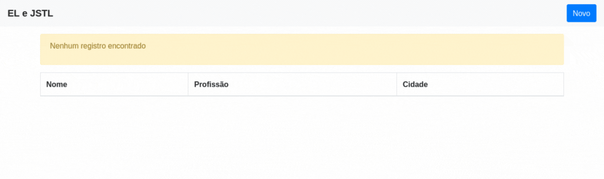

<div style="text-align: center">
    <h1 style="text-align: center">EL-JSTL</h1>
    
</div>

## Índice

- [Sobre](#sobre)
- [Tecnologias utilizadas](#tecnologias-utilizadas)
- [Como utilizar o projeto](#como-utilizar-o-projeto)
    - [Requerimentos necessários](#requerimentos-necessários)
    - [Configuração](#configuração)
         
## Sobre

Este projeto fornece uma introdução prática e didática ao uso de Expression Language - EL e Jakarta Standard Language JSTL, linguagens de tags que adicionam recursos nas JSP's, possibilitando simplificar a construção de views.

A aplicação consiste em um CRUD em memória, que implementa as operações CREATE, READ e UPDATE.

Para ilustrar a utilização de EL e JSTL, foram desenvolvidas algumas views. Além disso, foram implementados de forma simplificada alguns controllers, utilizando Servlets.

## Tecnologias utilizadas

O projeto foi desenvolvido utilizando as seguintes tecnologias:

- Java 8
- Servlet 4
- JSTL 1.2
- Lombok 1.18

## Como utilizar o projeto

### Requerimentos necessários

- Java 8 previamente configurado

### Configuração

```bash
# clone o projeto e importe no Intellij.
$ git clone https://github.com/shifttodev/el-jstl.git
```

Execute a aplicação e acesso o endereço [http://localhost:8080](http://localhost:8080)
